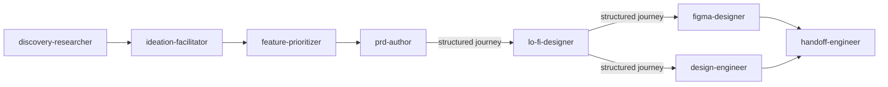
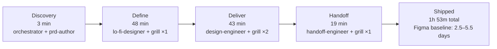

# Stop building AI tools. Build AI teams.

*Designing 18 AI agents like a product team — shipped in 1h 53m.*

---

Meet my product team: a PRD author, a lo-fi designer, a Figma designer, a design engineer, a critique partner — and thirteen others. All eighteen are AI. I am the only human. They are better than me at some of it. This is what I learned designing a team where none of the members are human.

> **V1 — The team.** Org chart of the 18 agents grouped by where they sit in the product lifecycle.

```mermaid
flowchart TB
    Human["The only human (me)"] --> Orchestrator["orchestrator"]
    Orchestrator --> Discovery
    Orchestrator --> Define
    Orchestrator --> Deliver
    Orchestrator --> CrossCutting
    CritiquePartner["critique-partner"] -.->|grills outputs of| Discovery
    CritiquePartner -.->|grills outputs of| Define
    CritiquePartner -.->|grills outputs of| Deliver

    subgraph Discovery["Discovery — 4 agents"]
      direction TB
      A1[discovery-researcher]
      A2[competitive-analyst]
      A3[ideation-facilitator]
      A4[product-positioner]
    end

    subgraph Define["Define — 5 agents"]
      direction TB
      B1[pm-strategist]
      B2[pm-launch-architect]
      B3[pm-metrics-architect]
      B4[feature-prioritizer]
      B5[prd-author]
    end

    subgraph Deliver["Deliver — 5 agents"]
      direction TB
      C1[lo-fi-designer]
      C2[figma-designer]
      C3[design-engineer]
      C4[usability-tester]
      C5[handoff-engineer]
    end

    subgraph CrossCutting["Cross-cutting — 2 agents"]
      direction TB
      D1[product-fingerprint-curator]
      D2[figma-component-bootstrapper]
    end
```



---

## The problem

Product design is being reshaped by AI, and most of the tools are getting it wrong.

Notion AI writes PRDs. Figma AI generates screens. Cursor writes code. v0 builds prototypes. Galileo mocks up flows. Each tool helps one phase of design work. None of them help the part that actually slows teams down — the connective tissue between phases.

The current industry consensus is that AI should make individual tasks faster. PRDs written in minutes. Screens generated in seconds. Code shipped in hours.

I think this is solving the wrong problem.

The hard part of product work isn't the individual artifact. It's the handoff. A PRD doesn't slow a team down when the PM writes it. It slows the team down the moment a designer reads it and starts guessing at the parts that aren't written. The same is true at every boundary: PRD to lo-fi sketch, lo-fi to hi-fi, hi-fi to engineering implementation. Context leaks at every step. Intent gets lost.

AI today writes the PRD faster. It does not fix the guessing.

I built Agent Harry — a team of 18 AI agents that does product design work — to test the opposite bet. What if you designed AI for the handoffs, not the tasks? What if the connective tissue was the part the AI specialized in?

This case study is what I learned.

---

## The reframe

Stop building AI tools. Build AI teams.

The conventional way to design an AI agent system is to treat it as software. You spec the agents. You define their APIs. You wire them together with a router. You ship.

This is the wrong mental model.

An AI agent system is closer to a team than to a piece of software. A team has roles, but the roles aren't the hard part. The hard part is how the team communicates, where the team meets, who pushes back on whom.

When I started thinking about Agent Harry as a team instead of a toolkit, three design questions emerged that I had not been asking:

1. **How do my agents hand off work to each other?**
2. **Where does my team meet?**
3. **Who tells my team when it's wrong?**

This case study walks through the first two. The third — the critique partner — deserves its own essay.

---

## Meet the team

The 18 agents are grouped by where they sit in the product lifecycle.

### Orchestration

- **orchestrator** — Parses the kickoff. Decomposes the goal, sequences the right sub-agents, inserts approval gates, synthesizes their outputs.

### Critique

- **critique-partner** — The devil's advocate. Stress-tests every PRD, every spec, every screen. Caught the Burmese honorifics bug. Caught the fake database relationship. Invoked between phases as a quality gate.

### Cross-cutting

- **product-fingerprint-curator** — Curates 3–7 designer-picked references and distills the project's visual language, composition patterns, and anti-patterns. Every Deliver agent reads from it.
- **figma-component-bootstrapper** — Generates a baseline Figma component library so the team has shared vocabulary before any feature work begins.

### Discovery

- **discovery-researcher** — Synthesizes user interviews, surveys, JTBD findings. Turns notes into structured insight.
- **competitive-analyst** — Competitor teardowns, UI pattern audits, feature-gap analysis, category positioning.
- **ideation-facilitator** — Divergent ideation, "How Might We" reframing, Crazy 8s. Runs before any wireframing.
- **product-positioner** — Sharpens positioning, value prop, differentiation, naming. Defines what the product isn't.

### Define

- **pm-strategist** — Works above features. Vision, business model, pricing, north-star, market scan.
- **pm-launch-architect** — GTM strategy, beachhead segment, ICP, battlecards, growth loops, pre-mortems.
- **pm-metrics-architect** — North-star, input, health, and counter-metrics. Tracking plans, OKRs, instrumentation.
- **feature-prioritizer** — RICE, MoSCoW, value-effort. Ranks the backlog, defends scope cuts.
- **prd-author** — Writes the PRD. Emits the structured journey shape every downstream agent consumes.

### Deliver

- **lo-fi-designer** — Markdown wireframes with ASCII layouts and three alternatives per screen.
- **figma-designer** — Production Figma files when the flow needs hi-fi before code.
- **design-engineer** — Real React/Next code with all five states wired (empty, loading, populated, error, edge). Often skips Figma entirely.
- **usability-tester** — Test plans, task scripts, finding synthesis, severity scoring.
- **handoff-engineer** — Engineering handoff doc: component contracts, design tokens, telemetry events, accessibility QA.

One human directs them. They direct each other. The structure of the team is the architecture of Agent Harry.

---

## Move 1: Designing the handoffs

**Industry today.** A PM writes a PRD in Notion. A designer reads it, sketches lo-fi in FigJam, builds hi-fi in Figma. An engineer opens Figma Dev Mode, switches to Cursor, starts implementing. Between each step, intent leaks. The designer guesses at PM intent. The engineer guesses at designer intent. Context loss compounds across four humans.

**Where AI helps today.** Each step now has an AI tool. Notion AI for PRD drafts. Figma AI for design generation. Cursor or Copilot for code. Each tool helps one phase. None of them help the handoffs. The context leak between phases stays a human problem — now with AI assistants at each end.

**How Agent Harry improves this.** `prd-author` writes a PRD that is more than markdown. Every PRD emits a structured journey: persona, entry condition, success exit, failure exit. `lo-fi-designer` reads the journey, not just the prose. `figma-designer` inherits the same journey. `design-engineer` inherits it again. By the time work reaches implementation, every agent has the same definition of "what does success look like." The journey is the contract.

The point isn't that AI writes faster. The point is that AI agents can be designed to refuse context loss — something human teams cannot enforce.

> **V2 — The pipeline.** Discovery → Define → Deliver flow, with the agents that activate at each stage.



> **V3 — The handoff shape.** Left: what most AI tools pass between phases. Right: what Agent Harry's agents pass.

```
BEFORE                                AFTER
─────────────────────────────         ─────────────────────────────
"Build a patient search modal         {
 for the dental clinic. It              "persona": "Burmese receptionist
 should be fast and handle               at multi-branch clinic",
 multiple branches."                     "entry_condition": "Patient
                                          calls; receptionist knows
[lo-fi-designer guesses                   phone, not name yet",
 success criteria]                       "success_exit": "Patient
[figma-designer guesses                   record opened in <2s",
 again]                                  "failure_exit": "Patient not
[design-engineer guesses                  in this branch — fall back
 one more time]                           cross-branch, then walk-in"
                                       }
                                       Propagated to every agent.
                                       No guessing.
```

**Lesson.** The handoff is the team's communication protocol. Most AI tools today are point solutions for individual phases. The real leverage is designing AI for the handoffs, not the phases.

---

## Move 2: Designing where the team meets

**Industry today.** Software teams live in dashboards. Linear for tickets. Jenkins for builds. Vercel for deploys. Figma for designs. Each tool is a UI surface with buttons, cards, lists. Click-to-action is the mental model designers and PMs spend their day in.

**Where AI helps today.** AI agent products are being built with the same dashboard instinct. LangChain agent UIs show agent cards with Run buttons. AutoGPT shows agent status in terminal panels. The default assumption: if you have agents, you need a dashboard to control them.

The contrarian model is Claude Code and Cursor. No dashboard. One chat. Agents are invoked by typing.

**How Agent Harry improves this.** Agent Harry takes the chat-only model further. There is no dashboard at all. Every agent decision — a journey, a PRD section, a Figma component spec, a handoff doc — renders as chat markdown. The user sees agent output in the same surface they would see a teammate's message. There is no second place to look.

This sounds like a UX simplification. It is actually an org design decision. When chat is canonical, the team has one place to meet. A dashboard would be a second one — and for a team that already lives in the conversation, one is enough.

> **V4 — Two surfaces compared.** Left: the dashboard pattern most AI agent products are shipping. Right: Agent Harry's chat-only surface.

```
DASHBOARD PATTERN                      CHAT-ONLY PATTERN
(LangChain / AutoGPT style)            (Agent Harry / Claude Code style)
─────────────────────────              ─────────────────────────────
┌─────────────────────┐                ┌─────────────────────────┐
│ ◯ agent 1     [Run] │                │ > orchestrate SF-35     │
│ ◯ agent 2     [Run] │                │                         │
│ ◯ agent 3     [Run] │                │ ✓ orchestrator          │
│ ◯ agent 4     [Run] │                │ ✓ lo-fi-designer        │
│ ◯ ...         [Run] │                │   → 304-line spec       │
│                     │                │ ✓ design-engineer       │
│ [Queue runs]        │                │   → 10 prototype files  │
│ [Status panel]      │                │ ✓ handoff-engineer      │
│ [Logs viewer]       │                │   → telemetry + a11y    │
└─────────────────────┘                │ ✓ critique-partner ×4   │
                                       └─────────────────────────┘
   ↑ control panel                        ↑ where the team meets
```

**Lesson.** Most AI agent UX today is built like industry dashboards — because dashboards are what we know. The right model is the conversation. People meet where the conversation is, not where the buttons are.

---

## What Agent Harry has shipped

Agent Harry built the Dental Clinic Management System end-to-end — the PRDs, the lo-fi flows, the production code. No Figma files were opened.

The clearest example is a feature called SF-35: a Cmd-K spotlight modal for patient search across three clinic branches. The receptionists are Burmese, and they search by phone number before they say a name. The feature had to handle Burmese honorifics — Daw, U, Ma, Ko — that English search libraries strip incorrectly. It had to fall back across branches when a patient wasn't local. It had to ship into a production header.

From kickoff to shipped code: **1 hour 53 minutes**. The same feature, in a traditional Figma → engineer handoff, takes **2.5 to 5.5 days**. That is a **10–25× speedup**, depending on the phase.

The pipeline that ran:

- `orchestrator` parsed the kickoff and queued the work
- `lo-fi-designer` emitted a 304-line markdown spec with three ASCII wireframe options
- `design-engineer` built 10 prototype files, scaffolded a mock backend with realistic latency, and integrated into the live `/clinic/dashboard` header
- `handoff-engineer` composed the engineering doc — 4 component contracts, 7 design tokens, 6 telemetry events with payload schemas, a 10-step accessibility QA script
- `critique-partner` ran four grilling rounds and caught a fake database relationship, a useEffect race causing a false loading flash, and the Burmese honorifics gap before any of it shipped

LLM cost for the full feature: **$2.12**. Annual projection across the DCMS backlog of ~40 features: **~$85**.

> **V5 — SF-35 build timeline.** Discovery to handoff in 1h 53m.



The shape that makes this possible — structured handoffs, chat as canonical surface, a critique partner who pushes back — is what the rest of this case study has been about.

---

## Takeaway

If you are designing an AI agent system, ask these two questions before you write any prompts:

1. **How do your agents hand off work to each other?**
2. **Where does your team meet?**

Answer those well, and the AI part takes care of itself. Skip them, and no model upgrade will save you.

The third question — *who tells the team when it's wrong* — is the subject of the next essay.

---

## Where to dig deeper

- Full SF-35 build log: [From Figma to Agentic Design — 1h 53m to Shippable](https://hello-harry.vercel.app/blog-sf35-agentic-design.html)
- Agent Harry on GitHub: [KaungMyatHein/agent-harry](https://github.com/KaungMyatHein/agent-harry)
- Wiki — concepts, agents, commands: [kaungmyathein.github.io/agent-harry/wiki](https://kaungmyathein.github.io/agent-harry/wiki/)
- More work at [hello-harry.vercel.app](https://hello-harry.vercel.app)
